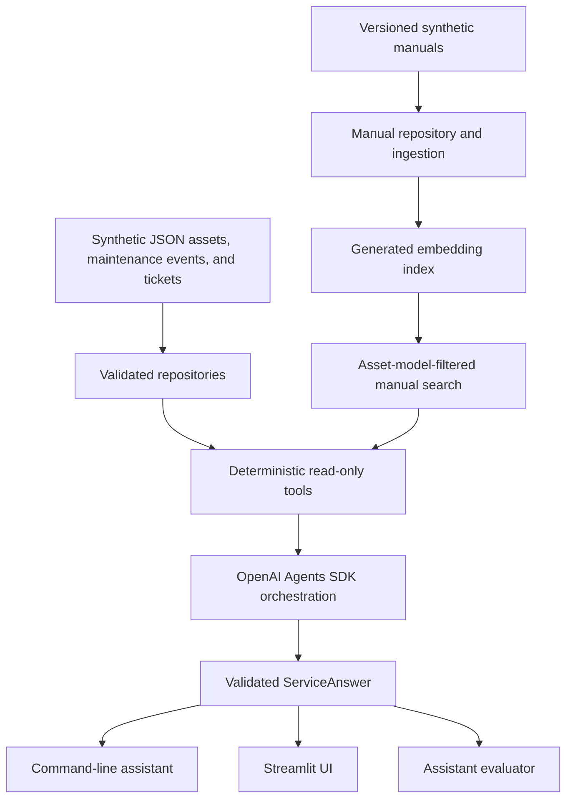

# Current architecture

This document describes only the system implemented in the current repository.
Possible future changes belong in [ROADMAP.md](ROADMAP.md).

## System view

## Synthetic data and repositories

`data/assets/assets.json`, `data/maintenance_history/maintenance_events.json`,
and `data/service_tickets/service_tickets.json` contain the structured
synthetic records. `asset_repository.py` and `service_repository.py` load and
validate schemas, identifiers, allowed values, dates, and relationships before
records are queried.

Versioned synthetic manuals live in `data/manuals/`. `manual_repository.py`
validates their metadata, sections, version status, and applicability to the
known manufacturer/model pairs. Superseded content remains available as
evidence but is explicitly labelled and cannot be presented as current
guidance.

## Deterministic tool layer

`asset_tools.py` exposes exact asset, history, ticket, and same-model incident
lookups. Exact IDs are normalized but never fuzzy-matched. Related incidents
are historical retrieval evidence, not a diagnosis.

`manual_index.py` performs the explicit ingestion step. It chunks manual
sections, embeds them in one batch, and persists text, citations,
manufacturer/model applicability, version status, source fingerprints, and
index configuration in the ignored `data/manual_index.json`.

`manual_tools.py` resolves the exact asset, filters candidates to that stored
manufacturer and model, calculates cosine similarity, sorts deterministically,
and applies the frozen `0.40` minimum similarity and default top-three limit.
No passing passage produces a structured abstention with no citation.

## Agent orchestration

`assistant_agent.py` registers five read-only functions with one Agents SDK
agent. A per-run `ToolExecutionContext` records validated asset IDs, tool calls,
results, and limitations. Asset-dependent calls require a successful
`get_asset_details` call in the same run.

Tool calls are sequential (`parallel_tool_calls=False`), so a dependent lookup
cannot race ahead of exact asset validation. Model routing and answer
composition remain probabilistic; exact lookup, tool guards, and post-processing
are enforced in Python.

## Structured answers and shared backend

`service_answer.py` defines the typed `ServiceAnswer` and its evidence-specific
sections: asset identity, confirmed history, manual guidance, missing
information, uncertainty, and optional escalation. Manual citations are checked
against passages actually returned during the run. Deterministic safety rules
can add required escalation even when the model omits it.

`run_assistant()` is the shared backend for:

- `assistant_agent.py`, which renders a Markdown command-line answer;
- `streamlit_app.py`, which presents the same structured answer visually; and
- `evaluate_assistant.py`, which inspects tool coverage, ordering, evidence,
  refusals, citations, and escalation.

The standalone `main.py` remains a small deterministic asset-list and exact
asset-lookup interface.

## Read-only and safety boundaries

The code exposes no mutation or equipment-control tool. The agent instructions
refuse record changes, equipment operation, definitive diagnosis, repair or
return-to-service authorization, and safety-control bypasses. Missing,
ambiguous, conflicting, or safety-critical evidence must be surfaced rather
than filled from general knowledge.

The enforced decision boundaries are:

1. A missing, malformed, or unknown required identifier produces a request for
   an exact valid ID; the assistant does not guess a record.
2. Ambiguous identity or conflicting records stop the answer until the identity
   or authoritative source is resolved.
3. Missing or conflicting evidence is stated explicitly and escalated to the
   record owner or a qualified technician.
4. Fire, smoke, fuel or chemical leakage, exposed electrical parts, brake or
   steering failure, uncontrolled movement, or serious-injury risk triggers
   advice to stop using the asset when safe, follow the appropriate emergency
   process, and contact a qualified technician.
5. Requests to operate equipment or create, alter, approve, close, or dispatch
   records are refused.
6. Definitive fault diagnosis, repair authorization, repair-success
   confirmation, and return-to-service decisions require a qualified
   technician.
7. Requests to bypass guards, alarms, interlocks, lockout/tagout measures, or
   manufacturer safety procedures are refused.

An escalation identifies the triggering rule, available evidence, remaining
unknowns, immediate safe action, and appropriate qualified review. It must not
invent measurements, records, citations, or conclusions.

These boundaries reduce POC risk; they do not make the assistant a production
safety system. There is no authentication, production deployment, live-system
integration, telemetry connection, or qualified-human approval workflow.

## Evaluation boundary

Unit tests use fake model and embedding behavior and are deterministic. Manual
retrieval evaluation checks the current corpus, filtering, ranking, threshold,
and expected passages. Live assistant evaluation also exercises model-selected
routing and composition and can vary between runs. Recorded results demonstrate
POC capability only, not production reliability or safety certification.
